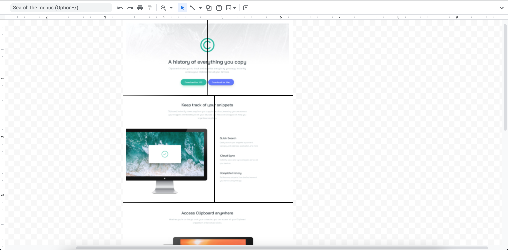
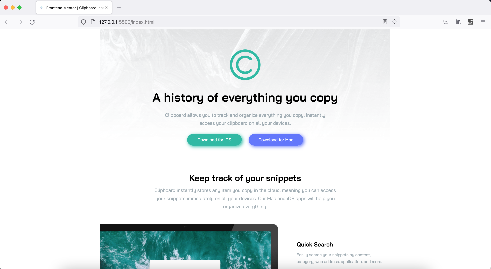
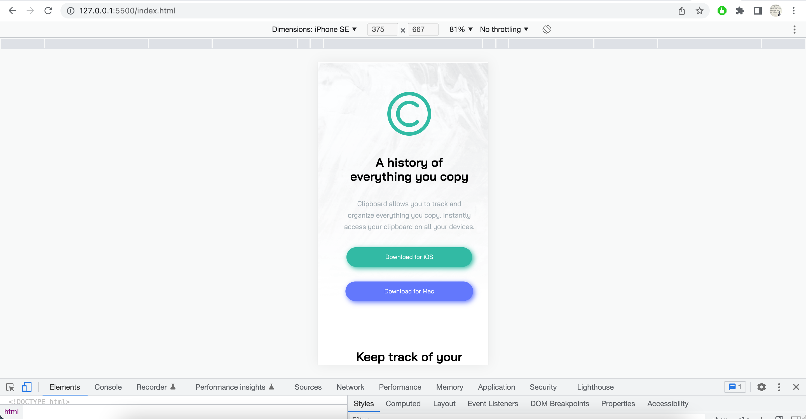

# Frontend Mentor - Clipboard landing page solution

This is a solution to the [Clipboard landing page challenge on Frontend Mentor](https://www.frontendmentor.io/challenges/clipboard-landing-page-5cc9bccd6c4c91111378ecb9). Frontend Mentor challenges help you improve your coding skills by building realistic projects.

## Table of contents

- [Overview](#overview)
  - [The challenge](#the-challenge)
  - [Screenshot](#screenshot)
  - [Links](#links)
- [My process](#my-process)
  - [Built with](#built-with)
  - [What I learned](#what-i-learned)
  - [Continued development](#continued-development)
  - [Useful resources](#useful-resources)
- [Author](#author)
- [Acknowledgments](#acknowledgments)

## Overview

This is 11th project from "Frontend Mentor" to sharpen HTML & CSS skills along with responsive web design and it's build with "BEM", "Grid & Flexbox layout".

### The challenge

Users should be able to:

- View the optimal layout for the site depending on their device's screen size
- See hover states for all interactive elements on the page

### Screenshot

### Links

- [Live Site URL](https://vikramvi.github.io/Clipboard-landing-page/)

## My process

### Built with

- Semantic & Accessible HTML5 markup
- CSS BEM
- CSS Grid
- CSS Flexbox
- Mobile-first workflow

### What I learned

- Usage of width + max-width instead of large margin or padding values
- Resizing images
- Spacing between items
- Positioning of items in both mobile and desktop views
- Breaking big problems into smaller chunks and building on top of it
- FF and Chrome dev tool usage in various conditions
- Google "semantic html best practices"
- Google "html semantic elements rules"
- Google "can I use html body element as grid container"

### Continued development

- Need to practice more about width, height, positioning of items within Grid & Flexbox layouts
- How to avoid overflow issues

### Useful resources

- Frontend Mentor slack community + website
- YT videos
- Google ofcourse
- Stackoverflow
- Twitter dev community

## Author

- Frontend Mentor - [@vikramvi](https://www.frontendmentor.io/profile/vikramvi)

## Acknowledgments

- FM community
- YT content creators
- Google + SO community
